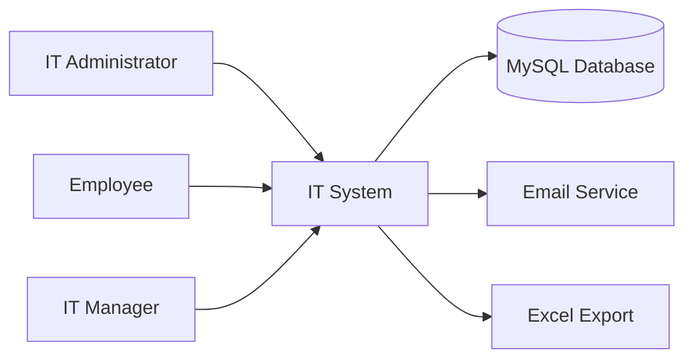
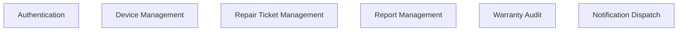
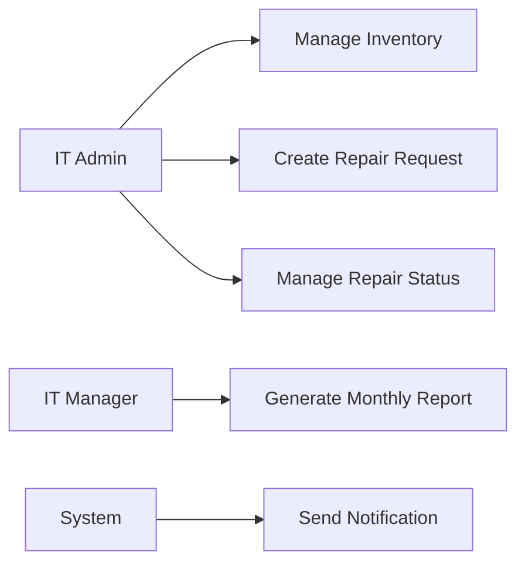

# รายงานโครงงานระบบ IT System

ระบบจัดการแจ้งซ่อมและทะเบียนอุปกรณ์ IT ภายในองค์กร

เอกสารฉบับนี้ปรับโครงสร้างหัวข้อหลักโดยอ้างอิงแนวทางจากบทความวิจัยที่ผู้ใช้ให้มา แต่ไม่ได้คัดลอกรูปแบบการจัดหน้า เนื้อหา หรือการนำเสนอของเอกสารต้นฉบับโดยตรง รายงานถูกปรับให้เหมาะกับโครงงานเว็บแอปพลิเคชัน IT System

## 1. บทนำ

IT System เป็นเว็บแอปพลิเคชันภายในองค์กรสำหรับช่วยฝ่าย IT จัดการทะเบียนอุปกรณ์และงานแจ้งซ่อมในศูนย์กลางเดียว ระบบนี้พัฒนาขึ้นเพื่อลดปัญหาการเก็บข้อมูลแบบกระจัดกระจาย การติดตามสถานะงานซ่อมที่ไม่ต่อเนื่อง และการจัดทำรายงานที่ต้องรวบรวมข้อมูลด้วยมือหลายขั้นตอน

งานเดิมของฝ่าย IT มักเกี่ยวข้องกับข้อมูลหลายส่วน เช่น รายการอุปกรณ์ใน Excel รายการแจ้งซ่อมจากผู้ใช้ สถานะงานซ่อม ประวัติการซ่อม และข้อมูลประกันอุปกรณ์ หากข้อมูลเหล่านี้ไม่ได้เชื่อมโยงกัน ผู้ดูแลระบบจะตรวจสอบย้อนหลังและวางแผนงานได้ยาก IT System จึงถูกออกแบบให้รวมข้อมูลสำคัญไว้ในระบบเดียว

วัตถุประสงค์ของโครงงาน:

- สร้างระบบจัดการทะเบียนอุปกรณ์ IT ที่ค้นหาและปรับปรุงข้อมูลได้ง่าย
- สร้างระบบแจ้งซ่อมและติดตามสถานะงานซ่อมอย่างเป็นระบบ
- เชื่อมโยงข้อมูลอุปกรณ์กับประวัติงานซ่อมเมื่อมีข้อมูลอุปกรณ์ใน inventory
- รองรับรายงานรายเดือนและการส่งออกข้อมูลเป็น Excel
- ช่วยให้ฝ่าย IT ตรวจสอบประกันอุปกรณ์และวางแผนงานได้สะดวกขึ้น

ขอบเขตของระบบครอบคลุม Dashboard, Device Inventory, Add New Device, Create Repair Request, Repair Status, Reports และ Warranty Audit โดยระบบนี้ออกแบบสำหรับ IT Administrator เป็นหลัก ไม่ใช่ระบบ self-service สำหรับพนักงานทั่วไป

## 2. การทบทวนระบบที่เกี่ยวข้องและแนวคิดพื้นฐาน

แนวคิดสำคัญของ IT System อยู่บนพื้นฐานของ IT Asset Management และ Ticket Management โดยแยกข้อมูลอุปกรณ์ออกจากข้อมูลรายการแจ้งซ่อม แต่ยังสามารถเชื่อมโยงกันผ่าน `deviceId` เมื่อ ticket นั้นเกี่ยวข้องกับอุปกรณ์ที่มีอยู่ใน inventory

| แนวคิด | การนำมาใช้ใน IT System |
|---|---|
| IT Asset Management | เก็บข้อมูลอุปกรณ์ เช่น deviceId, assetNo, department, assignedTo, model, warranty และ status |
| Ticket Lifecycle | กำหนดสถานะงานซ่อม เช่น Pending, In Progress, Waiting for Parts, Completed และ Closed |
| Data Integrity | ใช้ service/repository layer และ MySQL เพื่อลดการเขียน business rules ซ้ำ |
| Reporting | สรุป ticket ตามเดือนที่สร้างและรองรับการส่งออก Excel |
| Notification | แยก ticket event และ email job เพื่อไม่ให้การตอบกลับ API หลักช้าลง |

เทคโนโลยีที่ใช้ในระบบประกอบด้วย Next.js App Router, React, TypeScript, MySQL, Excel export/import และ Docker สำหรับการ deploy ภายในองค์กร โครงสร้างนี้ช่วยให้ระบบสามารถแยกส่วน UI, API route, business service และ database repository ได้ชัดเจน

## 3. การออกแบบและพัฒนาระบบ

ระบบ IT System ใช้โครงสร้างแบบเว็บแอปพลิเคชันภายในองค์กร โดยผู้ใช้เข้าสู่ระบบผ่านหน้า Login แล้วทำงานผ่าน Dashboard หลัก ข้อมูลอุปกรณ์และ ticket ถูกโหลดผ่าน API route และบันทึกลงฐานข้อมูล MySQL ผ่าน service/repository layer

ภาพรวมการไหลของข้อมูลระดับ Context แสดง actor สำคัญ ได้แก่ IT Administrator, Employee, IT Manager, IT System, MySQL Database, Email Service และ Excel Export

DFD Level 1 แสดงกระบวนการหลักของระบบ ได้แก่ Authentication, Device Management, Repair Ticket Management, Report Management, Warranty Audit และ Notification Dispatch

Use Case หลักของระบบประกอบด้วย Login/Logout, View Dashboard, Manage Device Inventory, Add New Device, Create Repair Request, Manage Repair Status, View Warranty Audit, Generate Monthly Report, Export Excel และ Send Notification

| ส่วนระบบ | หน้าที่สำคัญ |
|---|---|
| Authentication | ตรวจสอบสิทธิ์ admin และป้องกัน API สำคัญ |
| Device Management | จัดการข้อมูลอุปกรณ์ เพิ่ม ค้นหา แก้สถานะ และส่งออก Excel |
| Repair Ticket | สร้าง ticket, เปลี่ยนสถานะ, เพิ่ม note, แนบไฟล์ และบันทึก repair log |
| Reports | ดูและส่งออกรายงานรายเดือนตามวันที่สร้าง ticket |
| Warranty Audit | ตรวจสอบอุปกรณ์ที่ประกันใกล้หมดหรือหมดอายุแบบ read-only |

## 4. วิธีดำเนินงานและการทดสอบระบบ

การดำเนินงานเริ่มจากการศึกษาปัญหาจาก workflow งาน IT ภายใน เช่น การเก็บข้อมูลอุปกรณ์ใน Excel การรับแจ้งซ่อม การปิดงาน และการทำรายงาน จากนั้นจึงออกแบบข้อมูล หน้าจอ API และฐานข้อมูล ก่อนพัฒนาและทดสอบเป็นลำดับ

ขั้นตอนการดำเนินงานโดยสรุป:

- เก็บ requirement และวิเคราะห์ปัญหางานเดิม
- ออกแบบโครงสร้างข้อมูลและ route หลักของระบบ
- พัฒนา authentication, dashboard และ shell หลัก
- พัฒนา device inventory และ add new device
- พัฒนา repair request, repair status และ repair log
- พัฒนา reports, warranty audit และ notification pipeline
- ทดสอบฟังก์ชันหลักและจัดทำเอกสารส่งมอบ

### Workplan

ตารางแผนงานด้านล่างใช้วันที่ที่บันทึกไว้จริงในเอกสาร Word ล่าสุดของโปรเจกต์ โดยแถบสีน้ำเงินในตารางแสดงช่วง week ที่งานนั้นเกิดขึ้น และมีช่วงวันที่ทำงานระบุบนแถบอย่างชัดเจน

ด้านการทดสอบ ระบบมีชุดทดสอบสำหรับ auth/session, API validation, device service, ticket service, report logic, search grouping, warranty lifecycle และ notification pipeline นอกจากนี้ยังมีการตรวจสอบเชิงโครงสร้างของเอกสาร Word เพื่อป้องกันปัญหาภาษาไทยกลายเป็นเครื่องหมายคำถาม

| ด้านที่ตรวจสอบ | วิธีตรวจสอบ |
|---|---|
| Authentication | ทดสอบ session token, login/logout และ auth guard |
| Device API | ทดสอบ validation, duplicate deviceId และ database configuration |
| Ticket API | ทดสอบ create, status transition, stale conflict, notes และ attachments |
| Reports | ทดสอบ monthly filtering และ Excel export |
| Search/Warranty | ทดสอบ search grouping และ warranty lifecycle ด้วยวันที่คงที่ |

## 5. สรุปผลและข้อเสนอแนะ

ผลการพัฒนาทำให้ได้ระบบ IT System สำหรับช่วยฝ่าย IT จัดการอุปกรณ์และงานแจ้งซ่อมได้เป็นระบบมากขึ้น จุดเด่นของระบบคือการรวม inventory, repair request, repair status, report และ warranty audit ไว้ใน dashboard เดียว พร้อมออกแบบให้รองรับ MySQL และการส่งออกข้อมูลเป็น Excel

ผลลัพธ์สำคัญ:

- ลดการพึ่งพา Excel เป็นแหล่งข้อมูลเพียงแหล่งเดียว
- ทำให้ ticket และสถานะงานซ่อมตรวจสอบย้อนหลังได้ง่ายขึ้น
- เชื่อมโยง ticket กับอุปกรณ์ผ่าน deviceId เมื่อมีข้อมูลใน inventory
- รองรับรายงานรายเดือนและการตรวจสอบประกันอุปกรณ์

ข้อจำกัดของระบบปัจจุบัน:

- ระบบยังเหมาะกับ admin-only use ไม่ใช่ employee self-service portal
- notification pipeline พร้อมในระดับโครงสร้าง แต่ production ควรเชื่อม SMTP หรือ durable queue จริง
- ไฟล์แนบที่เก็บใน container filesystem ต้องมี persistent storage หากใช้ Docker production

ข้อเสนอแนะสำหรับการพัฒนาต่อ:

- ทำ UAT กับผู้ใช้ IT จริงเพื่อยืนยัน flow และข้อมูลในหน้าจอ
- เพิ่ม role/permission หากมีผู้ใช้หลายระดับ
- วาง backup/restore plan สำหรับ MySQL และ uploads
- เพิ่ม audit log สำหรับ mutation สำคัญ
- ปรับ notification ให้เชื่อมต่อ email provider จริงสำหรับ production
