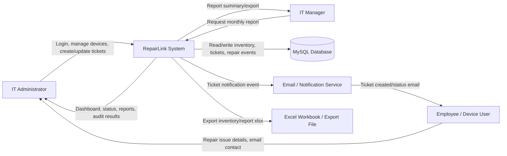
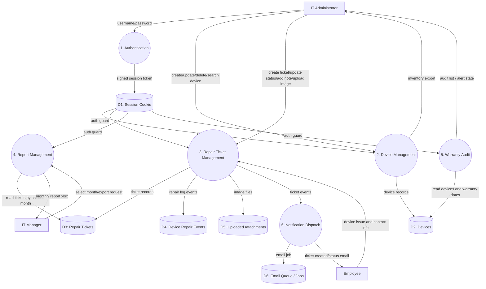
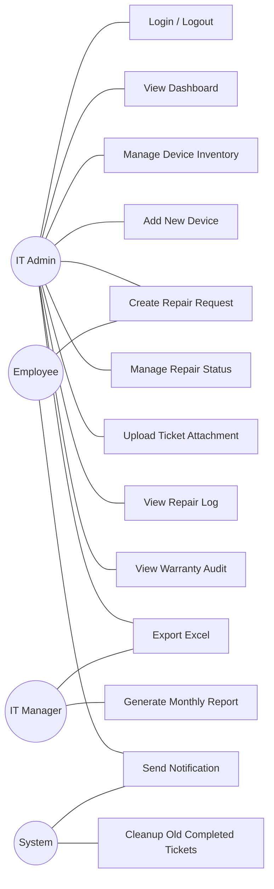

# รายงานวิเคราะห์และออกแบบระบบ RepairLink

## 1. ภาพรวมโครงการ

RepairLink เป็นเว็บแอปพลิเคชันภายในองค์กรสำหรับผู้ดูแลระบบ IT ใช้จัดการข้อมูลอุปกรณ์, สร้างและติดตามรายการแจ้งซ่อม, ตรวจสอบสถานะงานซ่อม, ออกรายงานประจำเดือน และตรวจสอบอายุประกันของอุปกรณ์ ระบบนี้ไม่ได้ออกแบบเป็น public customer portal แต่เป็นเครื่องมือปฏิบัติงานของฝ่าย IT/Admin เป็นหลัก

เทคโนโลยีหลักที่ใช้ในโปรเจกต์ปัจจุบัน ได้แก่ Next.js 16 App Router, React 19, TypeScript, MySQL, Excel import/export และ Docker สำหรับการ deploy ภายในองค์กร

## 2. ขอบเขตระบบปัจจุบัน

ฟังก์ชันที่มีอยู่ในระบบ:

- Login สำหรับ Admin และ session cookie แบบ HMAC signed
- Dashboard แสดงภาพรวมอุปกรณ์และ ticket
- Device Inventory สำหรับค้นหา ดูรายละเอียด แก้สถานะ/ผู้ถือครอง และลบอุปกรณ์
- Add New Device สำหรับเพิ่มอุปกรณ์ใหม่ตามฟิลด์จาก workbook
- Create Repair Request สำหรับเปิด ticket งานซ่อม
- Repair Status สำหรับติดตาม เปลี่ยนสถานะ เพิ่ม note แนบรูป และลบ ticket
- Reports สำหรับดู/ส่งออก ticket รายเดือนตามวันที่สร้าง ticket
- Warranty Audit แบบ read-only สำหรับตรวจสอบอุปกรณ์ที่ประกันใกล้หมดหรือหมดแล้ว
- Notification pipeline สำหรับเตรียมส่ง email หลังสร้าง ticket หรือเปลี่ยนสถานะ โดยไม่บล็อก response หลัก

## 3. ผู้เกี่ยวข้องกับระบบ

- IT Administrator: ผู้ใช้งานหลักของระบบ ทำหน้าที่จัดการอุปกรณ์และ ticket
- Employee/User: ผู้แจ้งปัญหาหรือผู้ถือครองอุปกรณ์ ข้อมูลถูกใช้ใน ticket และ email notification
- IT Manager/Supervisor: ผู้ดูรายงานภาพรวมงานซ่อมและสถานะงานรายเดือน
- System: ส่วนประมวลผลอัตโนมัติ เช่น ตรวจ warranty, สร้าง repair log, queue notification
- MySQL Database: แหล่งเก็บข้อมูลอุปกรณ์, ticket, repair event และ metadata ที่เกี่ยวข้อง

## 4. DFD Level 0: Context Diagram

คำอธิบาย: ผู้ใช้งานหลักคือ IT Administrator ซึ่งทำงานผ่าน RepairLink System ข้อมูลสำคัญถูกบันทึกใน MySQL ส่วน Employee เป็นแหล่งข้อมูลของคำขอซ่อมและเป็นผู้รับ notification เมื่อมีการแจ้งซ่อมหรือเปลี่ยนสถานะ

## 5. DFD Level 1: กระบวนการหลัก

## 6. Data Store สำคัญ

- D1 Session Cookie: เก็บ token ชั่วคราวชื่อ `repairlink_session` สำหรับยืนยันสิทธิ์
- D2 Devices: เก็บข้อมูลอุปกรณ์ เช่น `deviceId`, asset, department, assignedTo, model, warranty, status
- D3 Repair Tickets: เก็บรายการแจ้งซ่อม สถานะ priority notes history attachments และ `completedAt`
- D4 Device Repair Events: เก็บ repair log ที่ผูกกับอุปกรณ์เพื่อให้ประวัติงานซ่อมยังอยู่แม้ ticket ถูกลบ
- D5 Uploaded Attachments: เก็บไฟล์รูปภาพประกอบ ticket ใต้ `public/uploads/tickets/<ticketId>/`
- D6 Email Jobs: โครงสร้าง queue/event สำหรับ notification หลังสร้างหรือปิด ticket

## 7. Use Case Diagram

## 8. Use Case รายละเอียด

| Use Case | Actor หลัก | เป้าหมาย | เงื่อนไขก่อนเริ่ม | ผลลัพธ์ |
|---|---|---|---|---|
| Login | IT Admin | เข้าใช้งาน dashboard | มี username/password admin | ได้ session cookie และเข้าสู่ `/dashboard` |
| Add New Device | IT Admin | เพิ่มอุปกรณ์ใหม่เข้าคลัง | Login แล้ว, มีข้อมูล device ขั้นต่ำ | บันทึก device ใหม่ในฐานข้อมูล |
| Manage Device Inventory | IT Admin | ค้นหา/ดู/แก้สถานะ/ลบอุปกรณ์ | Login แล้ว | ข้อมูล inventory เป็นปัจจุบัน |
| Create Repair Request | IT Admin | เปิด ticket งานซ่อมให้พนักงาน | Login แล้ว, กรอกข้อมูลปัญหา | ได้ ticket สถานะ `Pending` |
| Manage Repair Status | IT Admin | เปลี่ยนสถานะ เพิ่ม note แนบไฟล์ | มี ticket อยู่ในระบบ | ticket ถูกอัปเดตและมี history |
| View Repair Log | IT Admin | ดูประวัติงานซ่อมของอุปกรณ์ | มี deviceId หรือ ticket ที่เชื่อมกับ device | เห็นประวัติซ่อมจาก ticket/event |
| Warranty Audit | IT Admin | ตรวจสอบประกันหมดอายุหรือใกล้หมด | มีข้อมูลวันหมดประกันใน inventory | เห็นรายการเสี่ยงแบบ read-only |
| Monthly Report | IT Manager | ดูรายงาน ticket ตามเดือนที่สร้าง | Login แล้ว, เลือกเดือน | ได้รายการ ticket และ export ได้ |
| Export Excel | IT Admin/Manager | ส่งออก inventory หรือ report | มีสิทธิ์ใช้งานระบบ | ได้ไฟล์ `.xlsx` |
| Send Notification | System | แจ้งผู้เกี่ยวข้องเมื่อ ticket ถูกสร้าง/เปลี่ยนสถานะ | ticket mutation สำเร็จ | email job ถูก queue/dispatch |

## 9. Functional Requirements

- ระบบต้องให้ Admin login ก่อนใช้งาน dashboard และ API สำคัญ
- ระบบต้องจัดเก็บ device ด้วย `deviceId` เป็น identity หลัก
- ระบบต้องเพิ่ม แสดง ค้นหา แก้สถานะ แก้ผู้ถือครอง และลบ device ได้
- ระบบต้องสร้าง repair ticket ได้แม้อุปกรณ์นั้นไม่อยู่ใน inventory
- ระบบต้องรองรับ ticket status: `Pending`, `In Progress`, `Waiting for Parts`, `Completed`, `Closed`
- ระบบต้องรองรับ priority: `Low`, `Medium`, `High`, `Critical`
- ระบบต้องบันทึก history เมื่อสร้าง ticket, เปลี่ยนสถานะ หรือเพิ่ม note
- ระบบต้องตั้ง `completedAt` เมื่อ ticket ไปที่ `Completed` หรือ `Closed`
- ระบบต้อง export inventory/report เป็น Excel ได้
- ระบบต้องแสดง monthly report ตามเดือนที่ ticket ถูกสร้าง
- ระบบต้องตรวจ warranty โดยไม่แก้ไขข้อมูล inventory โดยตรงในหน้า audit
- ระบบต้องส่ง notification หลัง response หลักด้วย async side effect

## 10. Non-Functional Requirements

- Security: API mutation ต้องผ่าน auth guard และไม่ hardcode production credentials
- Reliability: status transition ต้องกัน stale update conflict ด้วย transaction/row lock
- Maintainability: แยก route, service, repository และ view ให้ชัดเจน
- Data Integrity: field สำคัญต้อง validate ก่อนบันทึก
- Performance: dashboard/search ควรโหลดข้อมูลจาก API แล้วทำ grouped search ฝั่ง client
- Deployment: รองรับ Docker Compose และ internal HTTP deployment ที่ port `18080`
- Testability: logic สำคัญมี test ด้วย Node built-in test runner และ `tsx`

## 11. Workplan งานที่ทำไปแล้ว

| Phase | งาน | สถานะ | Deliverable |
|---|---|---|---|
| 1 | วิเคราะห์ปัญหาและ scope ระบบ IT support ภายใน | เสร็จแล้ว | Scope: admin dashboard, inventory, tickets, reports |
| 2 | วางโครง Next.js App Router และ UI shell | เสร็จแล้ว | `/`, `/dashboard`, `/dashboard/[...slug]`, `RepairLinkApp` |
| 3 | ทำระบบ auth admin-only | เสร็จแล้ว | login/logout API, session cookie, API auth guard |
| 4 | ออกแบบ device model และ MySQL repository | เสร็จแล้ว | `devices` schema, service, API, Excel import/export |
| 5 | ทำ Device Inventory และ Add New Device | เสร็จแล้ว | inventory view, add form, status/assignment update |
| 6 | ทำ Create Repair Request | เสร็จแล้ว | ticket create form, optional `deviceId`, free-text employee/device flow |
| 7 | ทำ Repair Status management | เสร็จแล้ว | status transition, notes, attachments, delete ticket |
| 8 | ทำ repair log ที่ผูกกับ device | เสร็จแล้ว | persisted device repair events |
| 9 | ทำ Warranty Audit | เสร็จแล้ว | read-only warranty audit และ alert timestamp sync |
| 10 | ทำ Reports และ Excel export | เสร็จแล้ว | monthly ticket report, report export |
| 11 | ทำ notification pipeline | เสร็จแล้วระดับ demo | event dispatcher, templates, queue, console/email client interface |
| 12 | ทำ deployment docs และ Docker Compose | เสร็จแล้ว | `Dockerfile`, `docker-compose.yml`, deploy docs |
| 13 | เพิ่ม automated tests | ทำต่อเนื่อง | tests สำหรับ auth, device, ticket, reports, search, notification |

## 12. Workplan ขั้นต่อไปที่แนะนำ

| ลำดับ | งานถัดไป | เหตุผล |
|---|---|---|
| 1 | ทำ UAT กับผู้ใช้ IT จริง | ตรวจว่าหน้าจอและ flow ตรงงานประจำวัน |
| 2 | สรุป data dictionary จาก workbook จริง | ลดปัญหาชื่อ field ไม่ตรงกับเอกสาร/Excel |
| 3 | ทำ production email adapter | ตอนนี้ notification pipeline พร้อมแล้ว แต่ควรต่อ SMTP/queue จริง |
| 4 | วาง persistent storage สำหรับ uploads | Docker container replace แล้วไฟล์อาจหายถ้าไม่มี volume |
| 5 | เพิ่ม role/permission หากมีผู้ใช้หลายระดับ | ปัจจุบันเป็น admin-only |
| 6 | ทำ backup/restore plan สำหรับ MySQL และ uploads | ลดความเสี่ยงข้อมูลสูญหาย |
| 7 | เพิ่ม audit log สำหรับ mutation สำคัญ | เหมาะกับระบบภายในที่ต้องตรวจสอบย้อนหลัง |

## 13. ขั้นตอนการเก็บ Requirement ที่ควรใช้กับโปรเจกต์นี้

1. ระบุผู้มีส่วนเกี่ยวข้อง: คุยกับ IT Admin, หัวหน้า IT, ผู้ใช้งานที่แจ้งซ่อม และผู้ดูแล server
2. ศึกษางานปัจจุบัน: ดู workflow เดิม เช่น Excel inventory, การรับแจ้งซ่อม, การปิดงาน และการทำรายงาน
3. เก็บเอกสารจริง: ขอไฟล์ workbook inventory, ตัวอย่าง ticket/report, field ที่ต้องส่งต่อหัวหน้า
4. สัมภาษณ์ pain point: ถามว่างานไหนซ้ำซ้อน, ข้อมูลไหนหายบ่อย, รายงานไหนทำช้า, จุดไหนผิดพลาดบ่อย
5. เขียน as-is flow: วาดขั้นตอนเดิมตั้งแต่รับแจ้งปัญหา จนซ่อมเสร็จและรายงาน
6. เขียน to-be flow: แปลงงานเดิมเป็น flow บนระบบ RepairLink
7. แยก requirement: แบ่งเป็น functional, non-functional, data, security, deployment และ reporting
8. จัด priority: แยก Must have, Should have, Could have เพื่อกำหนด MVP
9. ทำ prototype/wireframe: ให้ผู้ใช้ดูหน้าจอก่อนลงรายละเอียด coding
10. นิยาม acceptance criteria: ระบุเงื่อนไขผ่านงาน เช่น สร้าง ticket ได้, export Excel ได้, status conflict ต้องแจ้ง 409
11. ทำ UAT script: เตรียมเคสทดสอบจากงานจริง เช่น เพิ่มอุปกรณ์, สร้าง ticket, ปิด ticket, export report
12. Sign-off: ให้ผู้เกี่ยวข้องยืนยัน scope, ข้อมูล, ข้อจำกัด และแผนส่งมอบ

## 14. ตัวอย่างคำถามเก็บ Requirement

- ใครคือผู้ใช้งานหลัก และมีผู้ใช้กี่ระดับ
- ข้อมูลอุปกรณ์ใน Excel มี column ใดที่จำเป็นต้องเก็บทุกครั้ง
- `Device Name` หรือ `Name` ใน workbook หมายถึง hostname, asset name หรือรหัสภายใน
- การแจ้งซ่อมเริ่มจากช่องทางใด เช่น โทร, Line, email หรือเดินมาแจ้ง
- ต้องการบังคับเลือกอุปกรณ์จาก inventory หรือเปิด ticket ให้ของนอกระบบได้
- สถานะงานซ่อมปัจจุบันมีอะไรบ้าง และแต่ละสถานะหมายถึงอะไร
- รายงานรายเดือนต้องนับจากวันที่สร้าง ticket หรือวันที่ปิดงาน
- ใครต้องได้รับ email เมื่อ ticket ถูกสร้างหรือปิดงาน
- ต้องเก็บรูปแนบไว้นานแค่ไหน และต้อง backup อย่างไร
- ระบบจะ deploy ในเครื่องไหน ใช้ domain/port อะไร และมี HTTPS หรือไม่

## 15. ข้อสมมติฐานและข้อจำกัด

- ระบบปัจจุบันเหมาะกับ internal admin use ไม่ใช่ employee self-service portal
- Production ต้องมี env credentials และ database configuration จริง
- Uploads ที่อยู่ใน container filesystem ต้องมี volume หากต้องการความถาวร
- Notification ปัจจุบันมีโครง event/queue แล้ว แต่ production ควรใช้ durable queue หรือ outbox table
- Warranty Audit เป็น read-only view ไม่ควรถูกใช้เป็นหน้าปรับแก้ inventory โดยตรง

## 16. สรุป

RepairLink เป็นระบบภายในสำหรับช่วยฝ่าย IT ลดงานซ้ำจากการจัดการ Excel และ ticket แบบกระจัดกระจาย จุดแข็งของระบบคือรวม inventory, repair request, status tracking, report และ warranty audit ไว้ใน dashboard เดียว พร้อมออกแบบให้เชื่อม MySQL และส่งออก Excel ได้ เหมาะสำหรับนำไปใช้เป็น MVP ภายในองค์กร แล้วต่อยอดด้วย UAT, email production adapter, backup strategy และ permission ที่ละเอียดขึ้นในรอบถัดไป
